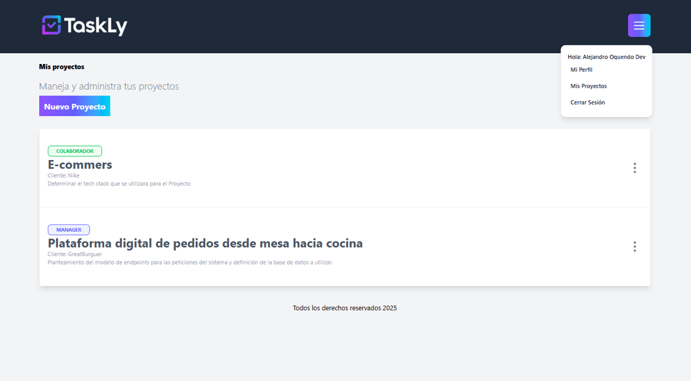
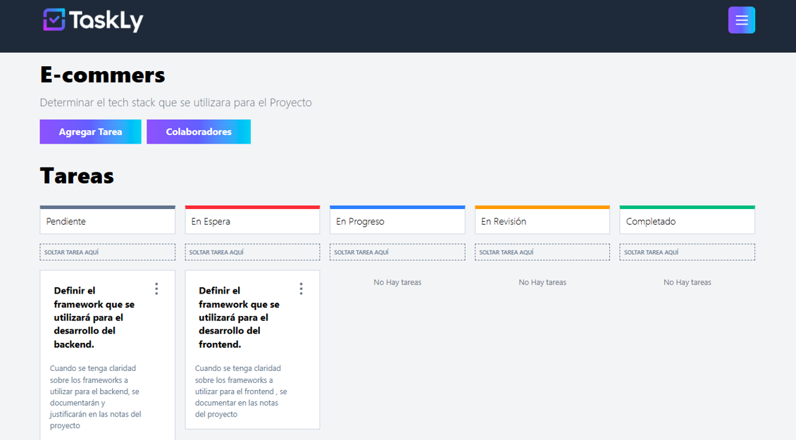
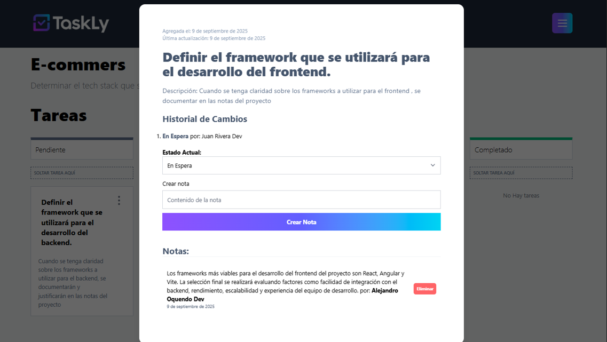

# 🗂️ Taskly - Gestión de Proyectos y Colaboradores

Taskly es una aplicación web para **gestionar proyectos colaborativos** de manera eficiente.  
Permite a los usuarios registrarse, crear proyectos, asignar colaboradores y gestionar tareas con un sistema de roles diferenciado: **managers** y **colaboradores**.

- Los **managers** pueden crear, editar y eliminar tareas dentro de sus proyectos.  
- Los **colaboradores** pueden agregar **notas dentro de las tareas** y **cambiar el estado de las tareas**, pero no pueden modificar la tarea en sí.  

Cada usuario puede participar en **varios proyectos**, y toda la gestión de usuarios y permisos está protegida mediante **JWT** para garantizar la seguridad.  
La interfaz permite **arrastrar y soltar tareas** o cambiarlas mediante un selector, ofreciendo una experiencia visual e interactiva para la gestión del flujo de trabajo.

Los estados disponibles para las tareas son: **Pendiente, En Espera, En Progreso, En Revisión, Completado**.

🔗 **Demo en vivo**: [https://taskly-frontend-rosy-nu.vercel.app/](https://taskly-frontend-rosy-nu.vercel.app/)  
🌐 **Portafolio**: [https://portfolio-drab-six-76.vercel.app/](https://portfolio-drab-six-76.vercel.app/)

---

## ✨ Características principales

- 👤 Registro de usuarios y autenticación segura con **JWT** y confirmación por correo electrónico.  
- 🗂️ Creación de proyectos y vinculación de colaboradores existentes.  
- 📝 Gestión de tareas por managers (crear, editar y eliminar).  
- 💬 Registro de notas dentro de las tareas por colaboradores y managers para seguimiento.  
- 🔄 Cambio de estado de tareas por managers y colaboradores: **Pendiente, En Espera, En Progreso, En Revisión, Completado**.  
- ⚡ Drag & drop y selector para cambiar estados de tareas de manera interactiva.  
- ⚡ Interfaz moderna y responsiva con **TailwindCSS** y componentes accesibles.  
- 📦 Manejo de formularios con **React Hook Form** y validación con **Zod**.  
- 📡 Manejo de datos y sincronización con **React Query**.  
- 🚀 Alertas y notificaciones con **React Toastify**.  

---

## 🛠️ Tecnologías utilizadas

- **React 19** + **TypeScript**  
- **Vite**  
- **TailwindCSS** + **@tailwindcss/forms**  
- **React Router DOM**  
- **React Hook Form** 
- **Zod** 
- **React Query / React Query Devtools** 
- **Axios** 
- **Lucide React** 
- **@dnd-kit/core** 
- **React Toastify**

---

## 📸 Vista previa

